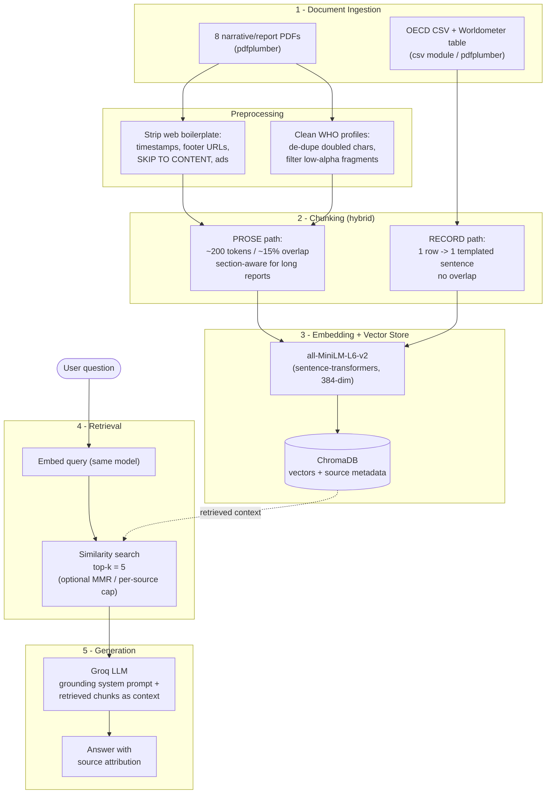

# Project 1 Planning: The Unofficial Guide

> Write this document before you write any pipeline code.
> Your spec and architecture diagram are what you'll use to direct AI tools (Claude, Copilot, etc.) to generate your implementation — the more specific they are, the more useful the generated code will be.
> Update the Retrieval Approach and Chunking Strategy sections if you change your approach during implementation.
> Update this file before starting any stretch features.

---

## Domain

<!-- What domain did you choose? Why is this knowledge valuable and hard to find through official channels? -->

**Domain: U.S. healthcare cost vs. outcomes in global perspective** — why the United States spends far more on healthcare than other wealthy nations yet does not achieve longer life expectancy or universal coverage. The guide covers what Americans pay (employer premiums, drug prices, hospital and physician costs), what *drives* that spending, and the outcomes and coverage that spending buys, benchmarked against OECD/WHO peer countries (with Afghanistan included as a low-income contrast case).

This knowledge is hard to find through official channels because it is fragmented across government appropriations reports, OECD/WHO statistical databases, think-tank chart collections, and journalism — each holding one piece (spending levels, cost drivers, insurance premiums, life-expectancy rankings, public-health funding). No single official source connects the dollars spent to the outcomes achieved. The guide consolidates these siloed, differently-formatted sources so a user can ask one question and get a sourced, cross-referenced answer.

---

## Documents

<!-- List your specific sources: URLs, subreddit names, forum threads, or file descriptions.
     Aim for at least 10 sources that together cover different subtopics or perspectives within your domain. -->

| # | Source | Description | URL or location |
|---|--------|-------------|-----------------|
| 1 | KFF — 2025 Employer Health Benefits Survey | What U.S. workers and employers actually pay: premiums, employee contributions, cost-sharing, offer rates | https://www.kff.org/health-costs/2025-employer-health-benefits-survey/ |
| 2 | Investopedia — *6 Reasons Healthcare Is So Expensive in the U.S.* | Accessible explainer of cost drivers: drug prices, provider salaries, administrative waste, profit motive | https://www.investopedia.com/articles/personal-finance/080615/6-reasons-healthcare-so-expensive-us.asp |
| 3 | Peterson-KFF Health System Tracker — *How does U.S. health spending compare to other countries?* | U.S. spending vs. OECD peers as % of GDP and per capita | https://www.healthsystemtracker.org/chart-collection/health-spending-u-s-compare-countries/ |
| 4 | Peterson-KFF — *What drives U.S. health spending compared to other countries?* | Decomposes drivers: hospital/physician payments vs. retail drugs and administrative costs | https://www.healthsystemtracker.org/brief/what-drives-health-spending-in-the-u-s-compared-to-other-countries/ |
| 5 | Commonwealth Fund — *U.S. Health Care from a Global Perspective 2026* | 20-country comparison linking spending to coverage and outcomes | https://www.commonwealthfund.org/publications/issue-briefs/2026/may/us-health-care-global-perspective-2026 |
| 6 | Worldometer — *Life Expectancy by Country 2026* | Ranked life-expectancy table for outcomes benchmarking | https://www.worldometers.info/demographics/life-expectancy/ |
| 7 | OECD Health Statistics — Health expenditure (% of GDP) | Structured dataset: expenditure as % of GDP across OECD countries (clean numeric source) | Local CSV: `healthcare_rag/data/raw_pdfs/OECD.ELS.HD,DSD_SHA@DF_SHA,+.A.EXP_HEALTH.PT_B1GQ._T.._T.._T.csv` |
| 8 | WHO — United States country profile | Official U.S. health stats: current health expenditure 17.36% of GDP (2021), demographics | https://data.who.int/countries/840 |
| 9 | WHO — Afghanistan country profile | Low-income contrast case for spending and outcomes | https://data.who.int/countries/004 |
| 10 | CRS / Congress.gov — *CDC Funding Overview* (R47207) | U.S. public-health and prevention funding context | https://www.congress.gov/crs-product/R47207 |
| 11 | WHO — *World Health Report 2000: Health Systems — Improving Performance* | Foundational framework for ranking health-system performance (historical, 2000 data) | https://www.who.int/publications/i/item/924156198X — local: `healthcare_rag/data/raw_pdfs/whr-2000.pdf` |

---

## Chunking Strategy

<!-- How will you split documents into chunks?
     State your chunk size (in tokens or characters), overlap size, and explain why those
     numbers fit the structure of your documents.
     A review-heavy corpus warrants different chunking than a long FAQ. -->

This corpus is **structurally heterogeneous**, so a single splitter does not fit all 11 sources. I use a **hybrid, type-aware strategy** with shared preprocessing, then two chunking paths.

**Chunk size:**
- **Prose path** (the 8 narrative/report PDFs): **~800 characters ≈ 200 tokens** per chunk.
- **Record path** (the 2 structured tabular sources + extracted ranking tables): **1 chunk per row/record**, no fixed character size.

**Overlap:**
- Prose path: **~120 characters (~15%, roughly one sentence)**.
- Record path: **none** — each record is already a self-contained fact, so overlap would only add noise.

**Reasoning:**

*Why ~200 tokens for prose:* The likely embedding model, `all-MiniLM-L6-v2`, truncates anything past **256 tokens**, so chunks must stay safely under that ceiling — ~200 tokens leaves headroom and guarantees nothing is silently dropped. It also matches the structure of the narrative sources (Investopedia, the two Peterson-KFF briefs, Commonwealth Fund): a complete comparative claim like *"the U.S. spends X% of GDP while peer countries spend Y%"* lives in one short paragraph (3–5 sentences ≈ 200 tokens). The ~15% overlap (about one sentence) keeps such a claim from being split across a boundary — the failure mode where retrieval returns the number but not the country it refers to.

*Why per-record for tabular sources:* In the OECD CSV (health expenditure % of GDP) and the Worldometer life-expectancy table, **each row is an atomic fact** (country → year → value). Character-based splitting would slice mid-row and destroy the country↔number association. Instead I transform each row into a templated natural-language sentence before embedding — e.g. *"In 2022, Belgium spent 10.74% of GDP on health."* / *"Monaco ranks #1 in life expectancy at 86.73 years (female 88.85, male 71.2)."* This turns messy structured data into clean, individually-retrievable fact chunks.

*Shared preprocessing (before either path):* Every PDF is a web capture carrying boilerplate that must be stripped or it pollutes chunks — repeated page-header timestamps (`6/8/26, 1:03 AM`), footer URLs, `SKIP TO CONTENT`, and ad text (e.g. Investopedia's `Top Stories Building ETF Portfolios…`). The two WHO country profiles (United States, Afghanistan) extract with **doubled characters** (`AAffgghhaanniissttaann`) and reversed axis labels from overlapping chart layers; for these I keep the clean stat callouts (`Current health expenditure (% of GDP) 17.36 (2021)`) and filter out low-quality fragments using a length / alphabetic-ratio threshold.

*Per-document handling for the two giants:* WHR-2000 (215 pg / ~733k chars) and the KFF Employer Survey (337 pg / ~339k chars) together are ~75% of the corpus text and, chunked naively, would swamp retrieval and starve the short briefs that most directly answer the core questions. Mitigations: (a) **section-aware splitting** on headings so chunks stay topically coherent rather than cutting mid-table; (b) **scope these to their high-value narrative sections** (KFF overview/summary rather than the full appendix tables) instead of ingesting every page; (c) tag every chunk with `source` metadata so retrieval quality can be inspected per source and, if needed, capped per source at query time.

**Estimated final chunk count:** ~600–900 chunks total (depending on how aggressively WHR-2000 and the KFF appendix are scoped) — roughly 230 from the narrative PDFs, ~500 templated records from the OECD CSV + Worldometer table, and the remainder from the scoped long reports. *(Confirm the actual count after Milestone 3 and record it in the README.)*

---

## Retrieval Approach

<!-- Which embedding model are you using (e.g., all-MiniLM-L6-v2 via sentence-transformers)?
     How many chunks will you retrieve per query (top-k)?
     If you were deploying this for real users and cost wasn't a constraint, what tradeoffs
     would you weigh in choosing a different embedding model — context length, multilingual
     support, accuracy on domain-specific text, latency? -->

**Embedding model:** `all-MiniLM-L6-v2` via `sentence-transformers` (384-dim, 256-token max), stored in ChromaDB.

It runs locally (free, no API key, no per-query cost or rate limits), is fast enough for an interactive query UI, and is a strong general-purpose model for English prose — which is what this corpus is (health-policy and economics text, not clinical notes). Its 256-token limit is the exact ceiling that set my ~200-token chunk size, so model and chunking are co-designed: with small prose chunks and per-record tabular chunks, nothing gets truncated and the limit is not a bottleneck.

**Top-k:** **5** (start here; tune during evaluation).

Chunks are small (~200 tokens), so 5 fit comfortably in the generation context. More importantly, the core questions are **comparative** — *"how does U.S. spending compare to peers?"* often needs a U.S. chunk, a peer chunk, **and** an OECD record in the same context — so k must be high enough to assemble a cross-source answer. I cap at 5 rather than going higher because the two oversized documents (WHR-2000, KFF) can crowd results with near-duplicate chunks; if evaluation shows one source dominating, I'll add **MMR / per-source diversity** or a per-source cap rather than simply raising k.

> **Implementation update (Milestone 4):** This contingency triggered. The smoke test showed the ~500 near-identical OECD records flooding spending queries (Q4 returned 5 Belgium rows, crowding out the U.S. figure). I added a **per-source diversity cap** (`max_per_source=2`) over a widened candidate pool (`max(k*12, 60)`) in `retrieve()`. This fixed Q2 (the drivers chunk now surfaces) but Q4 remains a partial result — the OECD records dominate the "% of GDP" semantic neighborhood so thoroughly that the U.S. figure never enters the pool. Q4 is documented as the failure case rather than over-tuned.

**Production tradeoff reflection:**

If cost weren't a constraint, I'd weigh moving from local MiniLM to a stronger model, judged against these axes:

- **Accuracy on domain text:** A larger general model (`all-mpnet-base-v2`, `BGE-large`, or API-hosted `text-embedding-3-large`) would improve retrieval precision on nuanced comparative claims where the difference between two chunks is subtle (e.g., *spending per capita* vs. *spending as % of GDP*). Notably, a **clinical/biomedical** embedder (PubMedBERT, MedCPT) would *not* clearly help and could hurt — my domain is health economics and policy, not clinical text, so a clinical model's vocabulary is a mismatch.
- **Context length:** MiniLM's 256-token cap forced me to split the long reports (WHR-2000, KFF) into small chunks, which is the source of my chunk-boundary failure risk. A long-context embedder (e.g., `text-embedding-3-large` at 8,191 tokens) would let me embed whole coherent sections — including tables — without splitting a comparison across a boundary. This is the tradeoff I'd most want to buy.
- **Multilingual support:** Not needed here — the corpus is entirely English. But if I expanded to non-English OECD/WHO national source documents, a multilingual model (`multilingual-e5`) would become necessary.
- **Latency & local vs. hosted:** Local MiniLM answers in milliseconds with full privacy and reproducibility; an API model adds network round-trips, rate limits, and sends queries to a third party. The data here is public, so privacy isn't a blocker — but for an interactive UI I'd weigh the per-query latency and recurring cost of a hosted model against the accuracy gain.

---

## Evaluation Plan

<!-- List your 5 test questions with their expected correct answers.
     Questions should be specific enough that you can judge whether the system's response
     is right or wrong. "What are good dining halls?" is too vague.
     "What do students say about wait times at [dining hall name] during lunch?" is testable. -->

| # | Question | Expected answer |
|---|----------|-----------------|
| 1 | How much did annual premiums for employer-sponsored **family** health coverage cost in 2025, and how much did workers contribute toward them? | ~**$26,993** total family premium (up 6% from 2024); workers contributed ~**$6,850**. *(Source: KFF 2025 Employer Health Benefits Survey — prose chunk.)* |
| 2 | What does the Peterson-KFF analysis identify as the **primary driver** of higher U.S. health spending versus peer countries — retail prescription drugs, or hospital and physician payments? | **Hospital and physician (service) payments** are the primary drivers; retail prescription drugs and insurer admin costs get more attention but are *not* the main driver. *(Source: Peterson-KFF "What drives health spending.")* |
| 3 | According to the Investopedia article, roughly how much more do Americans pay for prescription drugs compared to citizens of other developed countries? | **Almost four times (4x) as much** for pharmaceutical drugs. *(Source: Investopedia "6 Reasons…" — KEY TAKEAWAYS box.)* |
| 4 | What share of its GDP does the U.S. spend on health, and how does that compare to a peer country such as Belgium? | U.S. ≈ **17% of GDP** (WHO: 17.36%, 2021); Belgium ≈ **10.7%** (OECD: 10.74%, 2022) — the U.S. spends roughly **1.5–1.7×** as much. *(Multi-source: WHO U.S. profile prose chunk + OECD CSV record — tests cross-source retrieval.)* |
| 5 | Among the countries the Commonwealth Fund analyzed, which are the only ones that have **not** achieved universal health coverage? | The **United States and Mexico** are the only two of the 20 countries analyzed that have not achieved health coverage for all residents. *(Source: Commonwealth Fund "Global Perspective 2026" — outcomes/coverage prose chunk.)* |

---

## Anticipated Challenges

<!-- What could go wrong? Name at least two specific risks with reasoning.
     Consider: noisy or inconsistent documents, missing source attribution, off-topic
     retrieval, chunks that split key information across boundaries. -->

1. **Garbled table/figure extraction (ingestion stage).** The two WHO country profiles extract with doubled characters (`AAffgghhaanniissttaann`) and the Worldometer life-expectancy table extracts with reversed axis labels (`ycnatcepxE efiL`) and merged columns, because chart/figure layers overlap in the source PDFs. This produces noisy chunks and can make numeric facts (a country's rank or life-expectancy value) unretrievable. *Mitigation:* clean WHO text and prefer the OECD CSV as the authoritative numeric source; treat life-expectancy ranking questions as a known weak spot.

2. **Key info split across a chunk boundary (chunking → retrieval stage).** The core questions are comparative — e.g. Q4, *"U.S. vs. Belgium spending as % of GDP"* — and the two halves of that answer live in different sources (WHO profile + OECD record). If a single comparison gets split, retrieval can return the number without the country it refers to, or only one side of the comparison. *Mitigation:* ~15% prose overlap, self-contained per-record templated sentences, and top-k=5 to assemble both sides.

3. **Large documents crowding retrieval (retrieval stage).** WHR-2000 and the KFF survey are ~75% of the corpus text; their many near-duplicate chunks can dominate the top-k and starve the short briefs that most directly answer the core questions. *Mitigation:* scope these two to high-value sections, tag chunks with `source` metadata, and add MMR / per-source cap if evaluation shows one source dominating.

4. **Temporal mismatch / stale figures (ingestion → generation stage).** WHR-2000 carries year-2000 data while the rest of the corpus is 2024–2026; the model could surface a 26-year-old figure as if current. *Mitigation:* attach publication-year metadata to chunks and instruct the generation prompt to prefer recent sources and state the year of any figure it reports.

---

## Architecture

<!-- Draw a diagram of your pipeline showing the five stages:
     Document Ingestion → Chunking → Embedding + Vector Store → Retrieval → Generation
     Label each stage with the tool or library you're using.
     You can use ASCII art, a Mermaid diagram, or embed a sketch as an image.
     You'll use this diagram as context when prompting AI tools to implement each stage. -->

The pipeline's defining feature is the **two-path hybrid chunker** (prose vs. structured records) feeding a single shared vector store.



**ASCII fallback:**

```
[PDFs: pdfplumber]──┐
                    ├─▶ [Preprocess: strip boilerplate / clean WHO]──▶ [PROSE chunker ~200tok/15%]──┐
[CSV + table]───────┘                                                 [RECORD chunker: row→sentence]─┤
                                                                                                     ▼
                                                              [all-MiniLM-L6-v2]──▶ [ChromaDB + source metadata]
                                                                                                     │
   [User question]──▶ [embed query]──▶ [top-k=5 similarity search]◀─────────────────────────────────┘
                                                │
                                                ▼
                              [Groq LLM: grounding prompt + context]──▶ [answer + source attribution]
```

| Stage | Tool / Library |
|-------|----------------|
| 1 Ingestion | `pdfplumber` (PDFs), Python `csv` (OECD data) |
| 2 Chunking | Custom hybrid splitter (prose + record paths) |
| 3 Embedding + store | `sentence-transformers` (`all-MiniLM-L6-v2`) → `chromadb` |
| 4 Retrieval | ChromaDB similarity search, top-k=5 |
| 5 Generation | `groq` LLM with grounding system prompt |

---

## AI Tool Plan

<!-- For each part of the pipeline below, describe:
     - Which AI tool you plan to use (Claude, Copilot, ChatGPT, etc.)
     - What you'll give it as input (which sections of this planning.md, which requirements)
     - What you expect it to produce
     - How you'll verify the output matches your spec

     "I'll use AI to help me code" is not a plan.
     "I'll give Claude my Chunking Strategy section and ask it to implement chunk_text()
     with my specified chunk size and overlap" is a plan. -->

**Milestone 3 — Ingestion and chunking:**
- *Tool:* Claude (Claude Code).
- *Input I'll give it:* the **Chunking Strategy** and **Architecture** sections of this file, plus 2–3 real extracted-text samples (one narrative PDF, one WHO profile, one OECD CSV row).
- *What I expect it to produce:* an `ingest()` that loads PDFs with `pdfplumber` and the CSV with `csv`; a `preprocess()` that strips web boilerplate and cleans the doubled-character WHO text; and a hybrid chunker exposing `chunk_prose(text)` (~200 tokens, ~15% overlap, section-aware) and `chunk_records(rows)` (one templated sentence per row). Each chunk carries `source` and `publication_year` metadata.
- *How I'll verify:* run it over all 11 files and check the chunk count lands in my ~600–900 estimate; spot-check that prose chunks are ≤256 tokens (no truncation), that CSV records read as clean sentences, and that boilerplate/garbled fragments are gone.

**Milestone 4 — Embedding and retrieval:**
- *Tool:* Claude.
- *Input I'll give it:* the **Retrieval Approach** section and the chunk objects (text + metadata) from Milestone 3.
- *What I expect it to produce:* an `embed_and_store()` that embeds chunks with `all-MiniLM-L6-v2` and writes vectors + metadata to a persistent ChromaDB collection, and a `retrieve(query, k=5)` that embeds the query with the same model and returns the top-5 chunks with their source metadata.
- *How I'll verify:* run my 5 evaluation questions and inspect the retrieved chunks before any generation — confirming Q4 actually pulls *both* the WHO U.S. chunk and the OECD/Belgium record, and that WHR-2000/KFF aren't crowding out the briefs. If they are, I'll add MMR / a per-source cap.

**Milestone 5 — Generation and interface:**
- *Tool:* Claude.
- *Input I'll give it:* the **Grounded Generation** requirements (from the README), the `retrieve()` function, and my desired UI (Gradio or Streamlit per `requirements.txt`).
- *What I expect it to produce:* a `generate(query)` that calls a Groq LLM with a **grounding system prompt** (answer only from the supplied context; if the context doesn't contain the answer, say so; cite the source of each claim), formats the retrieved chunks as labeled context, and returns an answer with source attribution — wrapped in a simple query UI.
- *How I'll verify:* run all 5 evaluation questions end-to-end, checking each answer matches the expected answer and cites the correct source; then test an **out-of-domain** question (e.g. "What's the best pizza in Chicago?") to confirm the model refuses rather than hallucinating.

---

## Stretch Features (Extra Credit)

> Per the project brief, each stretch feature is specced here *before* its code is written.

### A. Hybrid Search (BM25 + semantic)

**Goal:** Combine dense semantic retrieval (the existing ChromaDB cosine search) with sparse lexical retrieval (BM25) and compare the fused ranking to semantic-only on the 5 evaluation questions.

**Why it should help this corpus:** Semantic search is strong on paraphrase ("primary driver" ≈ "what drives spending") but weak on rare exact tokens — country names, acronyms, and specific figures. My hardest question is **Q4** (U.S. vs. Belgium % of GDP), where the dense neighborhood is flooded by ~500 near-identical OECD records and the literal token "Belgium" / "United States" never surfaces the right pair. BM25 rewards documents that contain the query's exact rare terms, so the templated record *"In 2022, Belgium spent 10.74% of GDP on health"* should rank highly for a query naming Belgium. Fusing the two signals is the standard fix.

**Design:**
- **Sparse:** A small pure-Python **BM25 (Okapi)** index built over the same `chunks.jsonl` corpus — no new dependency. Tokenize on lowercased word characters; standard `k1=1.5, b=0.75`.
- **Dense:** the existing `retrieve()` path (MiniLM + ChromaDB cosine).
- **Fusion:** **Reciprocal Rank Fusion (RRF)**, `score = Σ 1/(rrf_k + rank)`, `rrf_k=60`. RRF is rank-based, so it needs no score normalization between the two very different scales (cosine similarity vs. BM25 term scores). Each retriever contributes a candidate pool; fused list is truncated to top-k. The existing per-source diversity cap is applied **after** fusion.
- **API:** `hybrid.py` exposing `search(query, k, mode)` where `mode ∈ {"semantic", "bm25", "hybrid"}`, so the comparison harness and the app can switch modes through one entry point.

**How I'll compare / verify:** `compare_search.py` runs all 5 questions through `mode="semantic"` and `mode="hybrid"`, and reports, per question, whether each question's **gold source_id(s)** appear in top-k and at what rank. Gold sources: Q1 `kff_employer_survey`, Q2 `peterson_drivers`, Q3 `investopedia_6reasons`, Q4 `who_usa`+`oecd_health_expenditure`, Q5 `commonwealth_global`. Success = hybrid recovers ≥ as many gold sources as semantic-only, with the expectation that Q4 improves.

> **Result:** Both modes recover **5/6** gold sources (83% recall@5). Hybrid improved **Q2** (`peterson_drivers` rank 3 → 2) by rewarding the literal token "drives/driver". The remaining miss is **Q4's `who_usa` chunk** — under *both* modes the per-source cap fills the comparison with OECD records and the Commonwealth/Peterson briefs before the WHO U.S. profile ranks; BM25 didn't rescue it because the WHO profile phrases its figure as "Current health expenditure (% of GDP) 17.36" rather than naming "United States" near the number. So hybrid is a modest, honest win (better Q2 rank, no regressions) rather than a fix for the known Q4 cross-source gap, which remains documented rather than over-tuned.

### B. Chunking Strategy Comparison

**Goal:** Hold the corpus, embedding model, and retrieval identical and vary *only* the prose chunker, to test whether the planning.md choice (~800 char / ~120 overlap, sentence-aware) is actually the best of several options on the 5-question retrieval task.

**Strategies compared (prose path only; the atomic record/ranking chunks are held fixed because they are the controlled variable's complement, not under test):**
1. `sentence_400_60` — small sentence-aware chunks (~100 tokens). Tighter topical focus, but a multi-sentence comparative claim may split across a boundary.
2. `sentence_800_120` — **the current production strategy** (~200 tokens, ~15% overlap, sentence-aware).
3. `fixed_1600_0` — naive fixed 1600-char windows, no sentence boundaries, no overlap. Deliberately exceeds MiniLM's ~1024-char / 256-token ceiling to show **silent truncation** degrading retrieval — the exact failure the production size was chosen to avoid.

**Method:** `compare_chunking.py` rebuilds chunks under each strategy (reusing the real `chunk_prose` logic with swapped size params for 1 & 2, and a fixed-window splitter for 3), embeds each set into a fresh **in-memory** ChromaDB collection with the same MiniLM model, and runs the 5 questions through the identical top-k + per-source-cap retrieval. It reports per strategy: chunk count, avg/max chunk chars, and **gold-source recall@k** (same gold set as Feature A).

**How I'll judge "which performed better and why":** highest recall@k wins; ties broken by better (lower) average gold rank. The hypothesis under test is that `sentence_800_120` ≥ the alternatives, and specifically that `fixed_1600_0` loses recall because over-long chunks are truncated to 256 tokens at embedding time, dropping the tail text that some answers live in.

> **Result:**
>
> | strategy | chunks | prose avg chars | recall@k | avg gold rank |
> |---|---|---|---|---|
> | sentence_400_60 | 2173 | 328 | 5/6 | 1.6 |
> | **sentence_800_120** (prod) | 1391 | 702 | 5/6 | **1.4** |
> | fixed_1600_0 | 967 | 1574 | 5/6 | 1.4 |
>
> **Winner: `sentence_800_120`** — all three recover the same 5/6 gold sources, so the production size wins on the tiebreak (best average gold rank, 1.4) while being the most precise: the small 400-char chunks dropped **Q3** from rank 1 → 2 (splitting Investopedia's "4× drug prices" takeaway away from its surrounding context), confirming the boundary-split risk that motivated the ~200-token / ~15%-overlap choice.
>
> **Honest caveat:** `fixed_1600_0` did *not* visibly collapse on this question set despite exceeding MiniLM's 256-token limit — its truncation is harmless *here* only because each answer's key sentence happens to sit near the **start** of its chunk (which is what survives truncation). It remains the wrong default: it embeds only the first ~256 tokens of a 1600-char window (silently discarding the rest), yields coarse chunks that mix topics, and would fail the moment an answer lived in a chunk's tail. The comparison validates the production choice on *precision and safety*, not on a dramatic recall gap — which is the honest finding.

### C. Metadata Filtering

**Goal:** Let a user constrain retrieval to a subset of the corpus by **document source** and by **publication year** (the project's "filter by source / date / rating" — this corpus has no ratings, so source + year are the meaningful axes; the "reviews from the past year" example maps to a min-year cutoff).

**What metadata exists:** every chunk already carries `source_id`, `source`, `year`, and `kind` (set in `config.SOURCES` and stored in ChromaDB). So filtering needs no re-indexing — only a query-time predicate.

**Design — one filter spec, applied uniformly across all three search modes:**
- `filters = {"source_ids": [...], "min_year": int|None, "max_year": int|None}`.
- **Semantic path:** translate the spec into a ChromaDB `where` clause (`$in` on `source_id`, `$gte`/`$lte` on `year`, combined with `$and`) so filtering happens inside the vector query — not as a post-hoc trim that could empty out top-k.
- **BM25 path:** the same spec becomes a Python predicate applied to candidate chunks before scoring.
- This lives in `hybrid.py` so Features A + C compose: a filtered hybrid search just passes both `mode` and `filters`.

**UI:** the Gradio app gains a **source multiselect** (all 11 sources, empty = all) and a **"published since" year** control, plus a **search-mode** selector (semantic / bm25 / hybrid). Generation runs over only the filtered, retrieved chunks, so citations stay honest to the user's constraints.

**How I'll verify:** (1) a source-restricted query (e.g. limit to `oecd_health_expenditure`) returns only OECD chunks; (2) a `min_year=2025` filter excludes WHR-2000 (year 2000) and the 2024 Peterson drivers brief; (3) an over-tight filter that matches nothing degrades gracefully to "not enough information" rather than erroring.

> **Result:** All three verified. (1) returns only `oecd_health_expenditure` rows; (2) the `min_year=2025` set contained only 2025–2026 sources (`peterson_compare` 2026, `commonwealth_global` 2026, `investopedia_6reasons` 2025) — the 2024 drivers brief and year-2000 WHR were correctly excluded; (3) the impossible `min_year=3000` filter returned `[]`, which the generator turns into the standard "not enough information" refusal.

### D. Conversational Memory (multi-turn)

**Goal:** Support follow-up questions that depend on earlier turns — e.g. *"What share of GDP does the U.S. spend on health?"* → *"How does that compare to Belgium?"* → *"And which spends more per person?"* — where the later questions are elliptical ("that", "which") and would retrieve nothing useful on their own.

**The core problem:** retrieval is stateless — embedding *"how does that compare to Belgium?"* finds chunks about the word "compare", not about U.S. health spending. So memory has to act **before** retrieval, not just in the prompt.

**Design — history-aware query condensation:**
1. The Gradio chat already threads `history` (prior user/assistant turns) into the handler.
2. Before retrieving, if history is non-empty, a lightweight Groq call **rewrites the latest message into a standalone question** using the conversation so far (a "condense question" step, the standard conversational-RAG pattern). *"How does that compare to Belgium?"* → *"How does U.S. health spending as a share of GDP compare to Belgium?"* If the message is already self-contained, it is returned unchanged.
3. The **standalone** query drives retrieval (so Features A + C still apply), and the final grounded-answer prompt also receives a short transcript of recent turns for conversational fluency — while the grounding rules (answer only from retrieved context, refuse otherwise) are unchanged.

**Why a separate condense step rather than just dumping history into one prompt:** retrieval quality is the bottleneck. Stuffing raw history into the generation prompt doesn't help the retriever find the right chunks; rewriting the query does. Keeping condense and answer as two calls also keeps the grounding prompt clean and auditable.

**How I'll verify:** run the three-turn sequence above and confirm (a) the condensed query logged for turn 2 names "U.S." and "GDP" (not just "Belgium"), (b) turn 2's retrieved chunks include the OECD/Belgium record, and (c) a fresh first-turn question with empty history skips the condense call and behaves exactly as the single-turn app did.
